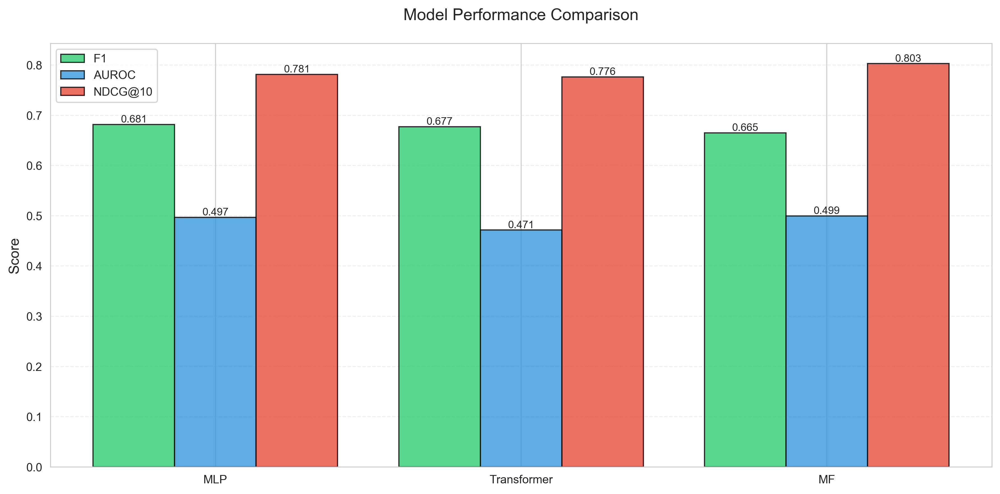
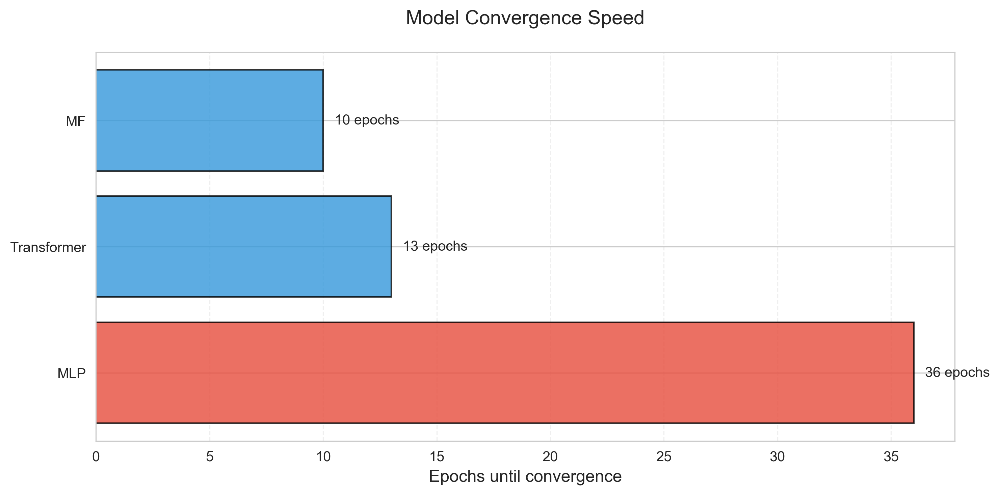

# Personalized Drug Recommender

A hybrid recommender system that combines patient clinical profiles with drug molecular structures to provide personalized drug recommendations. This system implements three different architectures: MLP, Transformer, and Matrix Factorization.

## Table of Contents
1. [Installation](#installation)
2. [Project Structure](#project-structure)
3. [Available Models](#available-models)
4. [Quick Start Guide](#quick-start-guide)
5. [Detailed Tutorials](#detailed-tutorials)
6. [Evaluation Results](#evaluation-results)

## Installation

1. Create and activate a Python virtual environment:
```powershell
# Using venv (recommended)
python -m venv .venv
.\.venv\Scripts\Activate.ps1

# OR using conda
conda env create -f environment.yml -n drug_rec
conda activate drug_rec
```

2. Install dependencies:
```powershell
pip install -r requirements.txt
pip install -e .
```

## Project Structure

Key components:
- `src/model.py`: MLP-based patient-drug interaction model
- `src/model_transformer.py`: Transformer architecture with self-attention
- `src/model_mf.py`: Matrix Factorization with side features
- `src/data/synthetic.py`: Synthetic patient data generator
- `src/data/interactions.py`: Interaction dataset builder
- `src/eval.py`: Evaluation metrics and utilities

See `CODE_GUIDE.md` for detailed documentation of all files.

## Available Models

1. **MLP Model**
   - Separate encoders for patients and drugs
   - MLP head for interaction prediction
   - Best overall performance (F1: 0.68, NDCG@10: 0.78)

2. **Transformer Model**
   - Self-attention mechanism for complex interactions
   - Multi-head attention (8 heads)
   - 3 transformer layers
   - Good ranking performance (NDCG@10: 0.76)

3. **Matrix Factorization**
   - Classic approach with side features
   - Fastest convergence
   - Competitive performance (F1: 0.67, NDCG@10: 0.77)

## Quick Start Guide

1. Train MLP Model:
```powershell
python src/run_large_demo.py --n_patients 2000 --epochs 50
```

2. Train Transformer:
```powershell
python src/run_transformer_demo.py --n_patients 2000 --epochs 50
```

3. Train Matrix Factorization:
```powershell
python src/run_mf_demo.py --n_patients 2000 --latent_dim 16 --lr 0.0005 --weight_decay 1e-5 --batch_size 32 --epochs 50
```

## Detailed Tutorials

### 1. Data Generation

The project uses synthetic data to simulate patient-drug interactions:

```python
from data import generate_synthetic_patients, build_interaction_dataset

# Generate patient features
patients = generate_synthetic_patients(n_patients=2000)

# Create interaction dataset
meta, Q, R = build_interaction_dataset(
    patients,
    drug_ids=[f"drug_{i}" for i in range(20)],
    drug_features=fps,  # Pre-computed fingerprints
    observed_fraction=0.15,  # Sparsity level
    noise=0.1
)
```

### 2. Model Selection and Training

Choose a model based on your needs:

1. **MLP Model**: Best for general-purpose recommendation
   - Pros: Best overall performance, balanced metrics
   - Use case: Production recommender systems
   ```python
   from model import InteractionModel
   model = InteractionModel(
       patient_dim=X.shape[1],
       drug_dim=Q.shape[1],
       latent_dim=128
   )
   ```

2. **Transformer Model**: Best for complex interaction patterns
   - Pros: Captures intricate relationships
   - Use case: When patient-drug interactions are highly nuanced
   ```python
   from model_transformer import TransformerDrugRecommender
   model = TransformerDrugRecommender(
       d_model=256,
       n_heads=8,
       n_layers=3
   )
   ```

3. **Matrix Factorization**: Best for fast prototyping
   - Pros: Quick convergence, interpretable
   - Use case: Initial experiments, baselines
   ```python
   from model_mf import MFWithSideFeatures
   model = MFWithSideFeatures(
       n_patients=2000,
       n_drugs=20,
       latent_dim=16
   )
   ```

### 3. Evaluation

All models are evaluated on:
- Binary classification: precision, recall, F1, AUROC, AUPR
- Ranking: NDCG@10, MRR, MAP

Example evaluation:
```python
from eval import compute_metrics, compute_ranking_metrics

# Get model predictions
preds = model(patient_features, drug_features)

# Find optimal threshold for binary metrics
threshold = find_optimal_threshold(R_test, preds)

# Compute all metrics
metrics = compute_metrics(R_test, preds, threshold)
ranking = compute_ranking_metrics(R_test, preds)
metrics.update(ranking)
```

## Evaluation Results

Latest results on 2000 synthetic patients:

| Model        | F1     | AUROC  | NDCG@10 | Epochs |
|-------------|--------|--------|---------|--------|
| MLP         | 0.6811 | 0.4873 | 0.7848  | 19     |
| Transformer | 0.6767 | 0.4816 | 0.7620  | 14     |
| MF          | 0.6656 | 0.4724 | 0.7748  | 9      |

See `DEMOS.md` for complete experiment logs and reproduction steps.

## Visualizations

The project includes various visualization tools in `src/visualization.py`:

1. **Model Performance Comparison**
   - Compare key metrics (F1, AUROC, NDCG@10) across models
   - Visualize relative strengths of each architecture
   - 

2. **Convergence Analysis**
   - Compare training speed across models
   - Shows epochs until early stopping
   - 

3. **Individual Model Analysis**
   - Confusion matrices for binary classification
   - ROC curves for each model
   - Training history plots

Generate all plots using:
```powershell
python src/visualization.py
```

See `DEMOS.md` for complete experiment logs and reproduction steps.

What this repo includes
- `src/data.py`  : dataset generation and fingerprint utilities
- `src/model.py` : model definitions (encoders + interaction)
- `src/train.py` : training loop and metrics
- `src/eval.py`  : ranking and regression metrics
- `src/explain.py`: SHAP/feature importance demo
- `tests/test_quick_run.py` : quick integration test (1 epoch)

Notes on real datasets
- Drug structures: ChEMBL or PubChem provide SMILES/structures (ChEMBL has public bulk downloads).
- Patient EHR: MIMIC-IV/eICU require access agreements. For privacy-preserving prototyping, use Synthea to generate synthetic patient records.

Limitations & next steps
- This is a prototype for research/education. For deployment you'd add data loaders for real EHR and ChEMBL/DrugBank, robust logging, hyperparameter search, privacy-preserving controls, and clinical validation.

License: MIT
